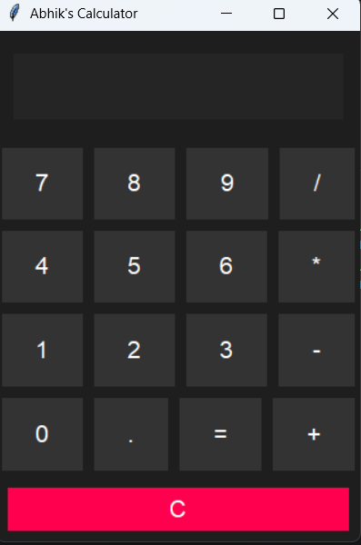

# 🧮 Python GUI Calculator

A simple and beautiful calculator built using Python Tkinter.

---

## ✨ Features
- Basic arithmetic operations
- Clean dark UI
- Error handling

---

## 📸 Preview


---

## ▶️ How to Run

```bash
python calculator.py
